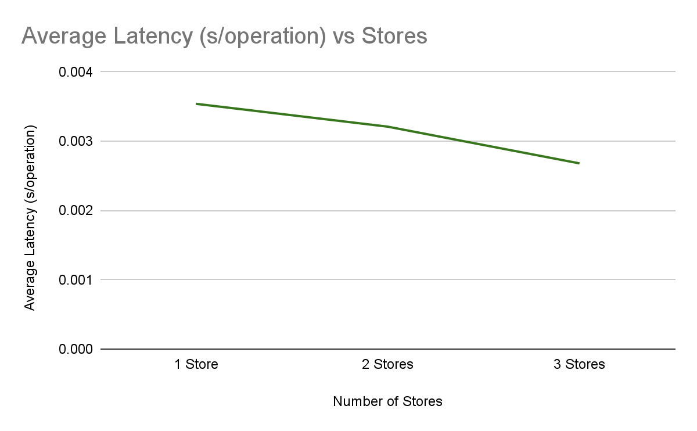
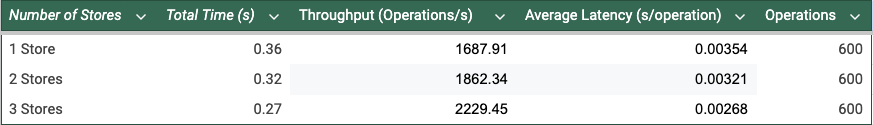
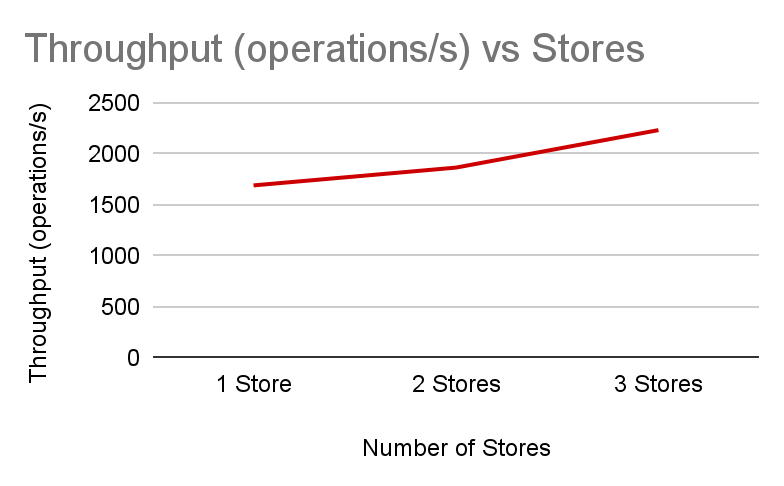
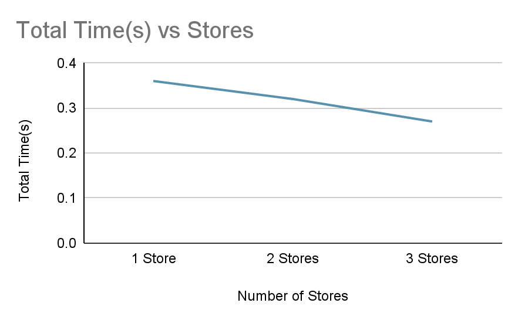

# Implementation Process
Similar to our original implementation of KV.py, we utilized a hashmap as our data structure to simulate the key-value storage. In our revised implementation, we are distributing our data across multiple in-memory dictionaries in kv_stores, one for each instance of the key-value store and managed using our HashRing.py class.

The HashRing class ensures consistent hashing by distributing keys evenly across each of the kv-stores. We use SHA-256 to hash each key when adding a node, and the corresponding store is retrieved by the get_store method. The get_store method hashes the given key and locates the corresponding store ID by sorting all of the hash keys in our hash ring and finding the first instance of a hash key that is greater than or equal to the key’s hash value, which provides the appropriate node to handle the key. If no such node is found, then the key is assigned to the first node in the hash ring, thus enabling the circular nature of consistent hashing. The add_node method adds a predetermined number of virtual nodes (i.e. 100 by default) to balance the distribution of keys among the stores. By using virtual nodes, the system provides fault tolerance, reducing the risk of uneven load distribution when nodes are added and removed.

# Challenges and how we overcame them
We initially struggled with how to conceptualize what data structures we would use to implement consistent hashing. When we found out that we should use a hashring, we also struggled on how to actually do this in code; We didn’t know how we would hash the virtual nodes, and how those nodes would relate to the KV stores. We underwent a cycle of trial and error of trying to map virtual nodes to a store id, and testing out the SHA-256 hashing algorithm. Some issues that we encountered were that our hashing algorithm wasn’t evenly distributing the load for similar keys because these keys would create similar hashes. However, once we ran our code with more test cases, we found that the load distribution was actually consistent.

# Results Summary
Our KV store program was tested by a script simulating 600 requests which were provided by Professor Anwar from coding assignment 1. Our results indicate that as the number of stores increased, the throughput increased while the average latency and total time to complete the requests decreased. Thus, this resulted in consistent optimization as the number of stores increased. Our charts of our test outcomes may be seen below.

